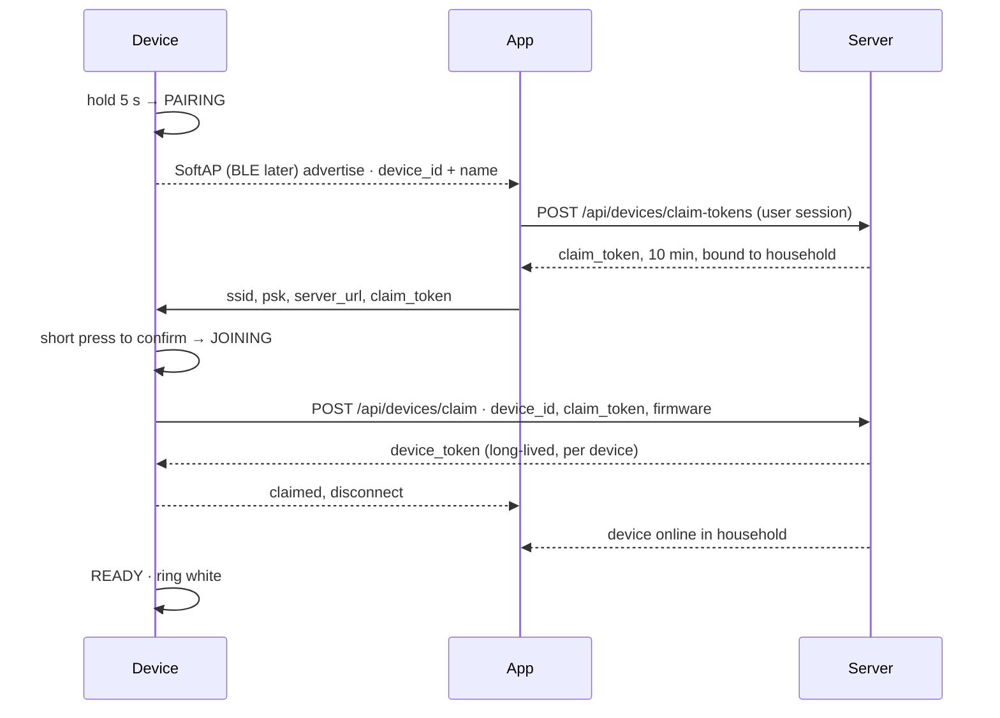
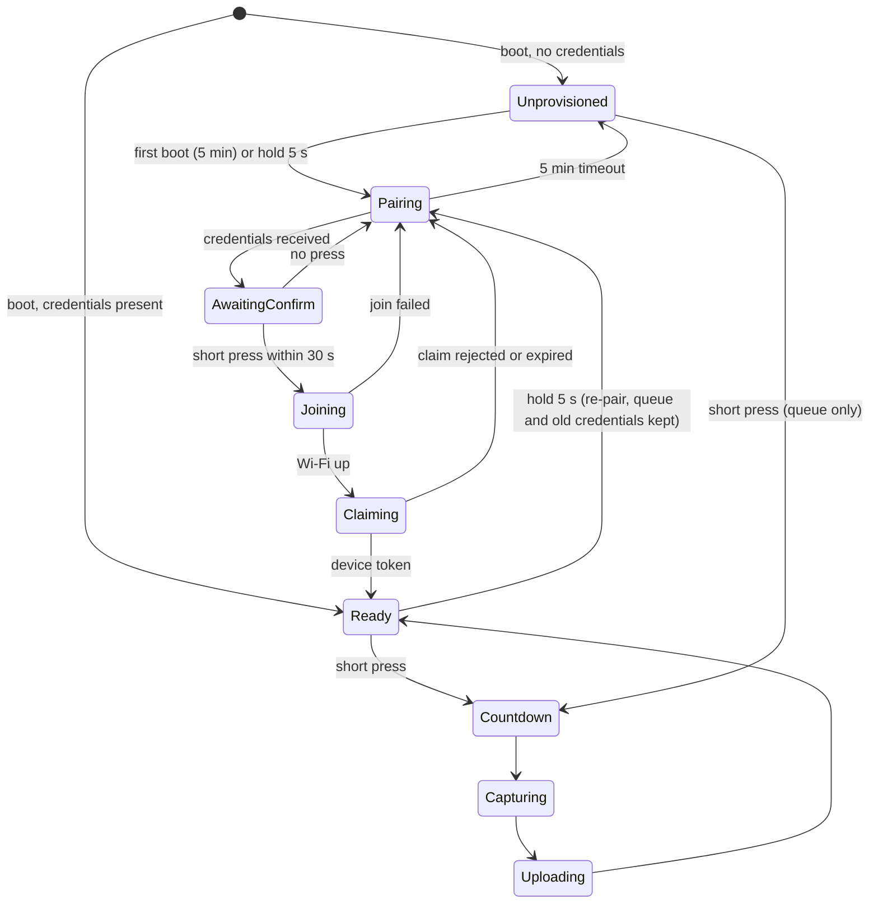
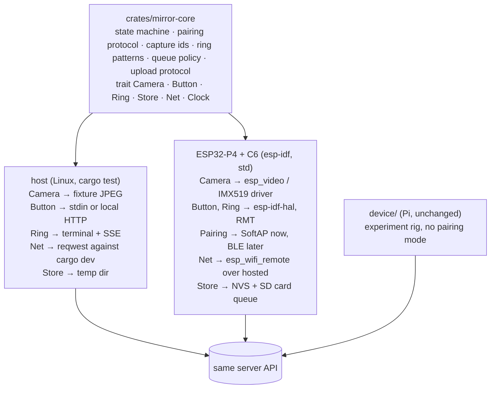

# Device pairing plan and the road to ESP32

Status: decided 2026-09-15. Rendered version with diagrams:
<https://claude.ai/artifact/AJ8jkTCpF3CUBxhGu6sRrC>.

## Decisions log

| Decision | Outcome | Date |
| --- | --- | --- |
| Pi vs ESP32 | The Pi is the camera and focus experiment rig. The ESP32 firmware is a fresh crate and the only pairing target. | 2026-09-15 |
| Board | ESP32-P4 dev board with the companion ESP32-C6 radio and the Arducam IMX519 sensor. | 2026-09-15 |
| Product resolution | 1080p through the P4 ISP for v1. Burst capture with server-side frame selection or stacking later. | 2026-09-15 |
| Firmware language | Rust on `esp-idf-svc`. Camera, provisioning and hosted Wi-Fi are reached through `esp-idf-sys` FFI bindings. | 2026-09-15 |
| Pairing transport | SoftAP first, because P4 BLE provisioning is unfinished upstream. BLE later without a protocol change. | 2026-09-15 |
| Proof of possession | Press the button to confirm. An optical blink-pattern claim is a later enhancement. | 2026-09-15 |
| Households | Exactly one per device. Moving requires a full reset and a fresh claim. | 2026-09-15 |
| Shared upload token | Retired. Per-device tokens only. Firmware never reads `DAILY_MIRROR_UPLOAD_TOKEN`. | 2026-09-15 |
| Long-press threshold | 5 s, ring fills amber from 2 s. | default |
| First-boot pairing window | 5 min, then offline capture. | default |

## 1. The out-of-box flow

Today a Pi is provisioned by hand: an operator writes the server URL and a
shared upload token into a root-readable env file. Pairing replaces that with
three moves split between three parties.

| Device | App | Server |
| --- | --- | --- |
| Enter pairing mode on long-press or first boot | Discover nearby devices in pairing mode | Mint short-lived claim tokens for signed-in users |
| Advertise itself locally | Ask the server for a claim token bound to this household | Redeem a claim: create the device row, issue a per-device token |
| Accept Wi-Fi credentials plus a claim token | Send Wi-Fi credentials and the claim token to the device | Attach the device to the household |
| Join Wi-Fi, redeem the claim, store its own device token | Wait for the server to report the device online | Report device presence to the app |

The two trust-bearing hops are the app handing the device a short-lived claim
token over the local link and the device trading it for its own long-lived
token over TLS. The app never sees the device token; the device never sees the
user's session.

### Why a claim token rather than sending the upload token locally

- **Per-device credentials.** Each device gets its own token, revocable from
  the app without touching the others.
- **The local link stays low-stakes.** It carries Wi-Fi credentials plus a
  token that dies in ten minutes and can be redeemed once.
- **Household binding happens server-side.** The claim token is minted for
  the signed-in user's household. A device belongs to exactly one household.
  Moving it means a full reset on the device and a claim from the new
  household, which revokes the old token and reassigns the row.
- **The shared token goes away.** Uploads authenticate with the per-device
  token. The server stops accepting the shared token once the last Pi rig is
  retired or reconfigured.

### Transport

Espressif's unified provisioning (`network_provisioning`) defines the BLE and
SoftAP transports, a Curve25519 handshake with proof of possession, custom
endpoints for extra data such as the claim token, official iOS and Android
SDKs, and an Expo-compatible React Native wrapper
(`@orbital-systems/react-native-esp-idf-provisioning`). BLE is the better
first-run experience. On the P4, BLE provisioning through the hosted C6 is not
finished upstream, so start on SoftAP and switch later. The app library
handles both.

### Proof of possession

After the app sends credentials, the ring pulses amber and the device waits up
to 30 s for a short press. No press, no claim.

Later: the device blinks a nonce on the ring, the app decodes it through the
phone camera and sends it with the claim. This proves the phone is looking at
*this* device when two are pairing side by side. It layers on the same
protocol and can land after v1.

## 2. Device state machine

A hold of 20 s followed by a triple-click within 3 s, from any state, is the
full reset: erase Wi-Fi credentials, device token, household binding, queued
photos and settings, then reboot into first-boot Pairing. It is the only
transition that destroys data.

### Button gestures

| Gesture | From | Effect |
| --- | --- | --- |
| Short press | Ready, Unprovisioned | Capture to the durable queue; upload if claimed |
| Short press | Awaiting confirm | Accept the phone that just sent credentials |
| Hold 5 s | Any | Enter Pairing. Ring fills amber from 2 s so the user can release to cancel. Old credentials survive until a new claim succeeds. |
| Hold 20 s, release, triple-click within 3 s | Any | Full reset. Ring goes solid red at 20 s; flashes red three times on the clicks. |

### Ring vocabulary

| State | Ring | Meaning |
| --- | --- | --- |
| Unprovisioned | Dim white, slow breathe | Works offline, not yet paired |
| Pairing | Amber, rotating chase | Discoverable; app can connect |
| Awaiting confirm | Amber, fast pulse | Press the button to accept this phone |
| Joining / Claiming | Blue, slow pulse | Talking to the network |
| Ready | Solid white | Unchanged |
| Countdown | Three slow amber pulses | Get into position |
| Capturing | Rapid amber pulses | Hold still |
| Uploading | Slow blue pulse | Transfer in progress |
| Pair failed | Red triple pulse, then previous state | Retry from the app |
| Reset armed | Solid red | Held 20 s; triple-click to wipe, or wait 3 s to abort |

## 3. The button before Wi-Fi exists

The button and ring are the only things that must work with zero network, so
they initialize before the Wi-Fi stack.

- Long-press threshold is 5 s. The ring starts filling amber at 2 s.
- First boot with no credentials enters Pairing for five minutes, then drops
  to Unprovisioned. Long-press is the way back in.
- Short press always captures to the durable queue. Only Pairing itself
  swallows the short press, because it needs it for confirmation.
- Debounce and press-length detection live in the platform-neutral core so
  the same timing rules run on the P4 and in host tests.

## 4. The ESP32-P4 firmware

The Pi was the experiment; the ESP32 is the product. The firmware is a fresh
crate, not a port. What carries over is the state names, ring vocabulary,
capture ID scheme, queue-then-upload rule and the signed-URL upload protocol.

Split the firmware into a platform-neutral core (`crates/mirror-core`) and one
thin adapter layer. The reason is testability: the core runs on a laptop.

### What emulation can and cannot mean

| Layer | Without a board | Confidence |
| --- | --- | --- |
| State machine, pairing, queue, upload | Host adapter + `cargo test`. Runs in CI. | High. This is where the bugs live. |
| Wi-Fi join, HTTP upload, NVS, OTA layout | Wokwi simulates the P4 (beta) with Wi-Fi through a virtual access point. Espressif's QEMU fork does not support the P4. | Medium. Smoke only. |
| SoftAP provisioning | Wokwi P4 simulates Wi-Fi through a simulated hosted co-processor. | Medium. Smoke only. |
| BLE provisioning | Not simulated anywhere and not yet supported upstream on the P4. | Low. |
| Camera capture | Not emulated anywhere. | None. |

### What the P4 plus IMX519 costs

| Fact | Consequence |
| --- | --- |
| IMX519 driver is ours | `esp_cam_sensor` has no IMX519 support, so `firmware/components/esp_cam_sensor_imx` carries our own sensor driver (register tables from the Raspberry Pi kernel driver, GPL-2.0) with binned modes up to 1080p. The focus motor on the Arducam module is an **AK7375**, not a DW9714 as first assumed; the one community port that assumed DW9714 never moves the lens. Verified on hardware 2026-09-17; see [esp32-bringup.md](esp32-bringup.md). |
| ISP caps at 1920×1080 | The product ships 1080p JPEGs in v1. Full-resolution raw bypass is off the table for now. |
| BLE provisioning through the C6 is unfinished | Wi-Fi and SoftAP over esp-hosted are solid. `network_provisioning` does not yet list the P4 as a target; the upstream pull request has been open since October 2025. |

Later: since the sensor runs at video rate in binned mode, one press can
capture a burst. The server picks the sharpest frame for the gallery and can
align and stack the rest for noise reduction. Firmware-wise this is "upload N
JPEGs under one capture ID".

### Rust on the P4

`esp-idf-svc` builds for the P4. Wi-Fi works only by pulling `esp_wifi_remote`
and `esp_hosted` in through the ESP-IDF component manager. Camera,
provisioning and hosted Wi-Fi all live in C and are reached through
`esp-idf-sys` bindgen bindings, each wrapped in its own small adapter module.
The core crate never sees any of it. The P4 needs ESP-IDF 5.3 or newer.

The camera spike is gated on hardware: it cannot start until the P4 board and
the IMX519 module are on the bench together. The first program to write is a
standalone one that initializes the IMX519, sets focus, and writes one 1080p
frame to SD.

## 5. How the work is split

1. **Contract first.** `crates/mirror-core` with the state machine, gesture
   detector, ring patterns, and the request and response models for the two
   new server routes. Host tests cover every transition above. Button timing
   and ring patterns are copied from the Pi crate, not moved, so the Pi keeps
   working.
2. **Server.** Devices table, claim-token mint, claim redeem, per-device token
   auth on uploads, presence, device list per household.
3. **Firmware.** New `firmware/` crate on `esp-idf-svc` with the host adapter
   first, then the P4 adapter. Order on the board: ring and long-press, hosted
   Wi-Fi join, SoftAP provisioning, claim, upload a fixture JPEG from flash,
   then the camera.
4. **App.** Discover screen, claim-token fetch, provisioning with the Espressif
   React Native library, "press the button now" step, device list under the
   household. Until the firmware reaches the board, the app can be exercised
   against Espressif's stock SoftAP provisioning example.

## Server contract

### `POST /api/devices/claim-tokens`

Authenticated with the user's session. Mints a single-use claim token bound to
the caller's household, valid for ten minutes.

Response: `ClaimTokenGrant { claim_token, expires_at, server_url }`.

### `POST /api/devices/claim`

Unauthenticated (the claim token is the credential). Body:
`DeviceClaimRequest { device_id, claim_token, firmware_version, hardware }`.

Response: `DeviceClaimed { device_token, household_id, device_name }`.
The claim token is consumed. A device that is already claimed by another
household is rejected unless the row was released by a full reset, which the
device signals with `previous_device_token: null` and a fresh `device_id`.

### Uploads

`POST /api/uploads` and `POST /api/uploads/{id}` are unchanged except that the
bearer token is now a per-device token looked up in the devices table. The
photo row records the device and therefore the household.

All models live in `crates/mirror-core/src/contract.rs` and are shared by the
server and the firmware.
