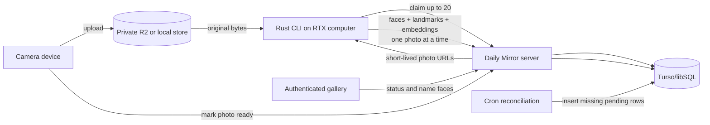

# Face processing, identity review, and centered portraits

## Purpose

Daily Mirror should let this computer occasionally act as a photo processor.
The operator starts one Rust CLI from the repository, it asks the server what
is waiting, and it processes photos until the queue is empty or the operator
presses Control-C. The camera, uploads, and gallery continue to work while the
processor is offline.

For each photo, processing produces only the durable observations needed by
later product features:

- one row for each detected face
- the face's bounding coordinates and landmarks
- one recognition embedding for the face
- model/version metadata needed to interpret those values

Naming a face, finding similar unknown faces, and centering a face are uses of
those stored observations. They are not separate background-job types.

The implemented `face-v5` baseline combines a full-frame MediaPipe pass with
scaled YuNet detections as additional region
proposals, MediaPipe Face Landmarker for a 478-point mesh on each proposed
crop, and SFace for a normalized 128-dimensional recognition embedding. All
three stages run in the Rust CLI. The versioned result contract leaves room to
replace any model after measured archive-wide evaluation.

## The operator experience

The normal interaction should be roughly this simple:

```text
$ just process
Daily Mirror processor connected
Pipeline: face-v5
Ready: 137 photos

Claimed 20 photos for 5 minutes
[1/20] 20260828T210000Z-ab12cd34  1 face  complete  842 ms
[2/20] 20260829T183015Z-78de9012  2 faces complete  931 ms
[3/20] 20260830T074455Z-5cdef678  processing...
^C stopping

2 photos completed. The current photo was not committed.
Remaining leases will expire automatically.
```

The next run continues with anything still pending or whose lease expired. A
photo is marked complete only after its entire face result has been accepted by
the server in one transaction.

There can also be a status-only command:

```text
$ just process-status
Pending: 135  Leased: 0  Complete: 842  Failed: 3
```

No queue daemon, local database, worker registration screen, or always-running
service is required for the first version.

## Core design decisions

1. **One unit of work is one photo.** There is no generic graph of analysis,
   matching, clustering, and rendering jobs.
2. **One processing row tracks each photo.** It has a small status and an
   expiring lease. The existing Turso/libSQL database is enough.
3. **The CLI claims up to 20 photos at once.** It processes them sequentially
   and commits each result immediately.
4. **Leases last about five minutes.** The CLI renews only the photo it is
   actively processing when necessary. Unstarted or interrupted items become
   claimable again after their leases expire.
5. **Completion is per photo and transactional.** A partial download, partial
   model run, Control-C, or lost connection never produces a completed row.
6. **Upload creates pending work.** A small cron reconciliation inserts any
   missing processing rows so an interrupted upload path cannot strand a photo.
7. **The worker produces faces, landmarks, and embeddings.** Identity
   assignments are ordinary database/UI decisions made from that data.
8. **Originals remain immutable.** Centering uses stored landmarks and can be
   rendered on demand or cached later without re-running face inference.

## Existing system

The current application already supplies the pieces this design should reuse:

- `server/src/photos.rs` abstracts local files and private Cloudflare R2
  objects.
- `server/src/catalog.rs` stores photo metadata in SQLite/libSQL or Turso.
- Upload completion verifies an object, creates its thumbnail, and marks the
  photo ready.
- Reconciliation already repairs interrupted uploads and missing thumbnails.
- The authenticated NextRS gallery is the natural place to display processing
  status and name faces.
- Production GPU work does not belong in Vercel request handlers.

The repository also contains legacy 2022 photographs and NumPy encodings under
`data/`. Those can be imported later, but the production catalog—not a bucket
listing or a recursive repository scan—should be the authoritative source of
photos needing processing.

## Architecture

The deployed server is the control plane. This computer is an intermittent
compute client.



The worker receives a dedicated token and short-lived read URLs. It does not
need permanent R2 or Turso credentials and does not scan storage directly.

## The processing row is the queue

Use a purpose-specific `photo_processing` table rather than a general job
system:

| Column | Purpose |
| --- | --- |
| `photo_id` | The ready photo being processed |
| `pipeline_version` | The detector/landmark/embedding contract in use |
| `status` | `pending`, `leased`, `complete`, or `failed` |
| `available_at` | Earliest time a pending retry can be claimed |
| `lease_token` | Random token required to complete the current claim |
| `leased_by` | Informational CLI installation ID |
| `lease_expires_at` | Normally five minutes after claim or renewal |
| `attempt_count` | Number of claims, for troubleshooting and retry limits |
| `last_error` | Short sanitized error from the most recent attempt |
| `created_at` / `updated_at` / `completed_at` | Basic status history |

Use a unique key over `(photo_id, pipeline_version)`. Re-running the cron or
enqueue operation is then naturally idempotent.

The upload/catalog status and processing status should remain separate. A
photo can be safely stored and visible in the gallery while its face processing
is still pending.

### Creating pending rows

When an upload is finalized and the photo becomes `ready`, insert its
`photo_processing` row for the active pipeline in the same server operation.
If that insert is interrupted or processing is introduced after photos already
exist, the existing maintenance cron runs the equivalent of:

```sql
INSERT INTO photo_processing (photo_id, pipeline_version, status)
SELECT photos.id, :active_pipeline, 'pending'
FROM photos
WHERE photos.status = 'ready'
ON CONFLICT (photo_id, pipeline_version) DO NOTHING;
```

The cron only repairs missing rows. It does not perform inference, start this
computer, or need to reset expired leases. The claim query can treat an expired
`leased` row as eligible work.

### Claiming a batch

`POST /api/processing/claim` accepts the worker ID, supported pipeline version,
and a limit capped at 20. In one database transaction the server:

1. Selects eligible `pending` rows and expired `leased` rows.
2. Sets each to `leased` with a different random lease token and an expiry
   about five minutes in the future.
3. Returns the photo ID, lease token, expected byte size, and a short-lived
   original read URL for each item.

The CLI keeps that batch only in memory. It does not copy queue state to a
local database.

Claiming 20 reduces network chatter, but completion remains one photo at a
time. Before beginning an item near expiry, the CLI renews that item's lease.
While inference is active, it renews only the active item if five minutes is
not enough. If an unstarted item's lease has already expired, the CLI discards
it from the in-memory batch and lets a later claim pick it up again. There is
no need to keep all 20 leases alive indefinitely.

### Completing one photo

For each claimed item, the CLI:

1. Downloads the original and checks its byte count.
2. Decodes it and applies orientation consistently.
3. Detects every face.
4. Generates landmarks and one recognition embedding for each face.
5. Validates the result locally.
6. Posts the complete photo result with its lease token.

The server verifies that the lease token is current and unexpired, then uses
one database transaction to replace any incomplete result for that photo and
pipeline, insert all face rows, and set `photo_processing.status = 'complete'`.

If the worker sends the same successful completion twice, the endpoint should
return the existing success. If an old lease submits after another attempt has
claimed the photo, the server rejects it rather than overwriting newer work.

### Control-C and crashes

The first Control-C should stop the current inference and prevent another item
from starting. If no completion request was accepted for the active photo, it
is not complete. The CLI may release its remaining leases as a courtesy, but
correctness must not depend on that request arriving; all leases expire.

A second Control-C can terminate immediately. Completed earlier photos stay
complete because each was committed independently.

### Failures

Keep failure handling modest:

- A network, server, or GPU availability error returns the photo to `pending`
  with a short backoff and sanitized `last_error`.
- A corrupt or unsupported image may become `failed` after a small configured
  attempt limit.
- An operator can reset a failed row to `pending` from the UI or CLI.
- Lease expiry handles a killed process or power loss without special cleanup.

The Rust CLI emits normal structured logs locally. The server needs current
status, attempt count, timing summary, and last error; it does not need a
database table containing every internal model event.

## What one completed photo stores

The result can stay compact: one analysis row and zero or more face rows.

### `photo_analyses`

- `photo_id` and `pipeline_version`
- oriented width and height
- original content digest if available
- face count
- processing duration and completion time

A valid photo with no detected faces is still a successful analysis with a
face count of zero.

### `faces`

- stable face-instance ID and photo ID
- detector confidence
- normalized bounding rectangle
- normalized landmark coordinates and the landmark schema/model version
- recognition embedding and embedding model version
- optional quality or pose values only if the selected model already produces
  values that prove useful
- nullable identity assignment fields described below

Landmarks can be stored as compact JSON or a binary payload because they are
read as a set. Embeddings belong directly in Turso/libSQL using a fixed-size
`F32_BLOB(dimension)` column once the model dimension is known. Turso's native
vector functions can perform cosine or other supported distance queries in the
same database; a vector index can be added later if the number of faces makes
exact scans too slow.

Do not compare embeddings produced by different embedding model versions.
Coordinates must be normalized against the correctly oriented original photo,
not against a resized inference tensor.

## Naming and recognizing people

Identity is not another processing job. It is a relationship between an
already stored face instance and a person.

Start with two small concepts:

`people`

- stable ID
- display name
- optional avatar face and notes

identity fields on `faces`

- nullable `person_id`
- state such as `unknown`, `proposed`, or `confirmed`
- source such as `manual` or `automatic`
- optional match score and `updated_at`

The initial workflow is:

1. The processor inserts faces without a person.
2. The UI uses Turso vector similarity to show known people or unknown faces
   with nearby confirmed embeddings.
3. The operator creates or selects a person and confirms the face.
4. Confirmed manual faces become the evidence used to recognize that person in
   later photos.
5. New high-scoring matches can first appear as proposals. Automatic
   assignment can be enabled later after thresholds are tested on this archive.

Finding similar unknown faces can be an on-demand database query in the UI. It
does not require a `recluster_unknowns` job or stored cluster lifecycle for the
first version. Likewise, confirming “yes, this is Drew” is a small database
update; the source embedding remains attached to the face and photo.

The UI should support correcting an assignment. To prevent recognition drift,
automatic matches should not become reference evidence until they are manually
confirmed.

### Recognition evaluation before automatic assignment

Before enabling automatic names, manually label a useful evaluation set from
the real archive: different years, poses, glasses, facial hair, occlusion,
distance, blur, lighting, and unknown visitors. Compare candidate models using
false accepts, false rejects, unknown rejection, ambiguous top-two matches,
throughput, and peak GPU memory.

The system should prefer leaving a face unknown over confidently attaching the
wrong person. The acceptable threshold and recognition model are decisions for
the inference follow-up.

## Landmarks and centering

MediaPipe Face Landmarker is the current landmark model, not the identity
model. Google's model bundle reports a 478-point 3D face mesh and can also
return blendshapes and a facial transformation matrix. The worker calls the
maintained MediaPipe Tasks C API through the safe `mediapipe` Rust crate and
stores only the mesh needed by this product.

Detection and landmarking remain separate stages. A full-frame MediaPipe pass
retains its strong selective detections. YuNet also runs on an image whose long
edge is 1600 pixels and proposes face regions at a 0.8 score threshold. Each
padded proposal is landmarked separately, then overlaps with the full-frame
results are deduplicated. This recovers small and motion-blurred faces without
discarding full-frame detections that work better in very dark scenes.

The image processor only needs to store landmarks. Centering is a deterministic
use of those landmarks and does not need its own queue entry:

1. Select the face instance to center.
2. Derive left-eye, right-eye, and mid-face anchors from its landmark schema.
3. Calculate translation, scale, and optional roll rotation for the desired
   view.
4. Use that transform as a gallery focal point/crop or render a derived image
   on demand.

In a multi-person photo, callers must select a face or person instead of
silently choosing the largest face. Originals remain untouched. If permanent
square or 4:5 portraits are useful later, cache them by photo ID, face ID, and
crop-version after the first request; they still do not need to occupy the
face-processing queue.

## Minimal server API

The first worker needs only a small surface:

| Endpoint capability | Purpose |
| --- | --- |
| Claim up to 20 photos | Return short leases and signed original URLs |
| Renew one lease | Keep a genuinely long active inference from being duplicated |
| Complete one photo | Transactionally insert analysis/faces and mark it complete |
| Fail or release one photo | Record a short error or make work available sooner |
| Read queue status | Support `process-status` and the web dashboard |

A single dedicated worker token is sufficient initially. It should grant only
photo reads and processing-result writes, not account administration or general
bucket access.

The operator-facing API adds straightforward reads and updates for processing
status, faces, people, and identity assignments. It does not expose lease
tokens to the browser.

## Minimal UI

Extend the existing authenticated gallery with:

- Queue totals for pending, leased, complete, and failed photos
- A list of failed photos with their last error and a retry button
- A processing badge on each photo
- A photo view that can overlay face boxes and landmarks
- A people page for naming unknown faces and correcting proposals
- A person page showing every confirmed face/photo
- A centered-face preview based on the stored landmarks

The CLI output is the primary live processor view. A worker registry, detailed
event stream, distributed tracing dashboard, and cluster-management UI can wait
until an observed need justifies them.

## Rust and RTX inference options

Rust and GPU acceleration are compatible choices. Rust can own the CLI,
networking, image decoding, preprocessing, postprocessing, and result contract
while a CUDA-capable runtime executes the neural networks.

Use one internal adapter boundary:

```rust
trait FaceProcessor {
    fn metadata(&self) -> PipelineMetadata;
    fn process(&mut self, image: &OrientedImage) -> Result<Vec<FaceResult>, ProcessError>;
}
```

Each implementation returns the same face bounding box, landmark schema, and
embedding contract.

| Path | Advantages | Main costs or risks |
| --- | --- | --- |
| Rust + ONNX Runtime CUDA | Practical access to many detector and embedding models; good NVIDIA support; application remains Rust | Native runtime/bindings; CUDA/cuDNN/ORT versions must be pinned; model graphs and preprocessing still need validation |
| Rust + ONNX Runtime TensorRT | Can improve throughput after a correct CUDA baseline | More compatibility and caching work; unsupported graph portions need CUDA fallback |
| Rust + direct TensorRT/TensorRT-RTX FFI | Maximum RTX-specific control and optimization | Largest unsafe/native integration and packaging surface; proprietary NVIDIA SDK boundary |
| Rust + Candle CUDA | Most Rust-native process and no Python runtime | Candidate face pipelines may require model ports, missing operations, or custom kernels |
| Rust + MediaPipe Tasks C API | **Current landmark path.** Safe Rust binding, mature 478-point output, no helper process | Native library/model packaging; GPU delegate was slower than CPU for the measured single-photo workload |
| Rust CLI + local Python/C++ inference helper | Fast way to benchmark model quality and establish a baseline | Additional process and packaging; useful for evaluation even if not the desired final architecture |

The computer exposes an NVIDIA GeForce RTX 5070. A future `just
process-doctor` command should verify the driver, CUDA/runtime versions, model
files, a small GPU inference, server access, and active pipeline compatibility
before claiming real photos.

The next inference discussion should select the model and backend together.
Backend speed is secondary to correct detections, stable landmarks, and
recognition quality on Daily Mirror photos.

## Reliability checks

The important tests are small and concrete:

- claiming the same pending rows concurrently never creates two valid leases
- expired leases become claimable
- an incorrect, old, or expired lease token cannot complete a photo
- a worker killed at every step leaves the photo either complete or reclaimable
- submitting a completion twice is idempotent
- a completion transaction never stores half the faces for a photo
- zero-face photos complete normally
- landmark coordinates map back to the oriented original correctly
- Control-C stops new work and does not mark the active photo complete
- upload and cron reconciliation create the same unique pending row

Keep a small consented or synthetic image set for detection and landmark
geometry tests. Use a larger private, manually labeled set for recognition
quality and thresholds.

## Privacy and security

Faces and embeddings are sensitive biometric data.

- Keep originals, face data, and any derived crops behind authenticated reads.
- Give the worker short-lived object URLs and a narrowly scoped token.
- Protect any local image cache with owner-only permissions and allow it to be
  disabled.
- Never log signed URLs, tokens, embeddings, or original image bytes.
- Deleting a photo must also delete its processing row and faces.
- Do not send photos to a hosted inference provider without a separate explicit
  decision.

## Implementation sequence

### 1. Simple queue and fake processor

- Add `photo_processing`, claim/renew/complete/fail endpoints, and worker auth.
- Add `just process`, `just process-status`, and a deterministic fake processor.
- Test five-minute lease expiry, Control-C, crashes, and per-photo commits.

Completion check: the CLI can claim 20 fake items, complete them one at a time,
stop anywhere, and resume later without losing or falsely completing work.

### 2. Face result storage

- Add `photo_analyses`, `faces`, and the shared Rust result schema.
- Add Turso vector storage once the embedding dimension is selected.
- Add face/landmark overlays and processing status to the gallery.

Completion check: a fake or reference engine can commit zero, one, or multiple
faces atomically for a photo.

### 3. Detector, landmarks, and embedding spike

- Compare MediaPipe and practical RTX/Rust inference paths behind
  `FaceProcessor`.
- Select model versions, preprocessing, coordinate conventions, embedding
  dimension, metric, licenses, and packaging.
- Run the selected pipeline on the private evaluation set before backfilling.

Completion check: overlays are geometrically correct, embeddings are
repeatable, and the RTX runtime is reliable from the same CLI used for real
work.

### 4. People and identity review

- Add people and identity fields to face records.
- Add nearest confirmed-face queries, naming, proposals, and corrections.
- Keep automatic assignment disabled until measured thresholds are accepted.

Completion check: naming a face requires no inference rerun, and new faces can
be reviewed against known people from their stored embeddings.

### 5. Backfill and enqueue-on-upload

- Run cron reconciliation to create missing rows for existing ready photos.
- Drain the archive in batches and review failures.
- Enable pending-row creation during every new upload finalization.

Completion check: this computer can be offline indefinitely, then run `just
process`, catch up safely, and stop at any point.

## Decisions for the inference follow-up

1. Does “all Rust” allow a native C/C++ CUDA runtime beneath the Rust process?
2. Which detector, landmark model, and recognition embedding model should be
   evaluated first?
3. Is MediaPipe preferred specifically for its landmarks even if recognition
   uses a different model/runtime?
4. What false-accept rate is acceptable before a face may be assigned
   automatically instead of proposed?
5. Should the old `data/people/**` folders be treated as trusted labels or just
   convenient review suggestions?

## References

- [MediaPipe Face Landmarker overview](https://developers.google.com/edge/mediapipe/solutions/vision/face_landmarker)
  describes its 478-point face mesh and optional transformation output.
- [ONNX Runtime execution providers](https://onnxruntime.ai/docs/execution-providers/)
  documents CUDA, TensorRT, and provider fallback architecture.
- [ONNX Runtime TensorRT provider](https://onnxruntime.ai/docs/execution-providers/TensorRT-ExecutionProvider.html)
  recommends CUDA as a fallback for graph portions TensorRT cannot execute.
- [NVIDIA TensorRT-RTX architecture](https://docs.nvidia.com/deeplearning/tensorrt-rtx/latest/architecture/architecture-overview.html)
  describes its desktop RTX deployment model.
- [Hugging Face Candle](https://github.com/huggingface/candle) documents its
  Rust tensor API, CUDA backend, ONNX support, and custom kernels.
- [Turso AI and embeddings](https://docs.turso.tech/features/ai-and-embeddings)
  documents native vector columns, distance functions, and optional indexing.
- [Cloudflare R2 presigned URLs](https://developers.cloudflare.com/r2/api/s3/presigned-urls/)
  describes short-lived, operation-specific access to private objects.
